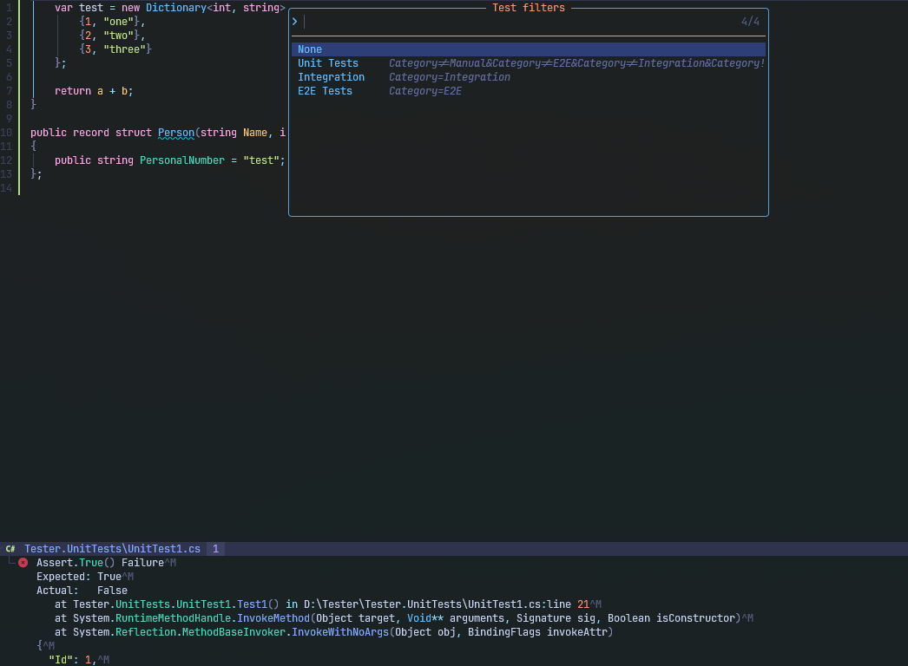

# Dotnet Test Traitor

Simply test runner for .NET projects which lets you run selected tests by defined filters.

Sample for xunit where you can define `Trait` for your tests in order to categorize it:

```csharp
using Xunit;

[Fact]
[Trait("Category", "Integration")]
public void SampleTest()
{
    Assert.True(true);
}
```

In order to run this test you would typically run `dotnet test --filter='Category=Integration'`.
This plugin simplifies it by allowing you predefine filters which can later be selected. Failed tests will by inserted in quickfix list which allows to quickly find them and fix.

It uses `Snacks.picker` for filter selection and `trouble.nvim` for displaying failed tests in quick fix list.


## Installation


### lazy.nvim

```lua
{
  "sebastianstudniczek/dotnet-test-traitor.nvim",
  ft = "cs",
  dependencies = { "folke/snacks.nvim", "folke/trouble.nvim" },
  --- @type dotnet-test-traitor.Configuration
  opts = {}
},
```

You can define your own filters in the configuration. Each filter consists of a name and a value. The value is a filter expression that is passed to the `dotnet test --filter` command.

```lua

opts = {
  filters = {
    {
      name = "Unit Tests",
      value = "Category!=Manual&Category!=E2E&Category!=Integration&Category!=Performance&Category!=Service|Type=Service-InMemory",
    },
    { name = "Integration", value = "Category=Integration" },
    { name = "E2E Tests", value = "Category=E2E" },
  },
},
```

## Key Bindings

The following key binding is set by default to run tests by filter:

- `<leader>tc`: Run Test Category
