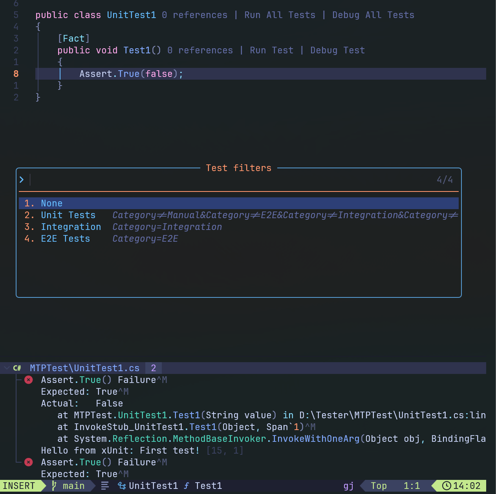

# Dotnet Test Traitor

A simple test runner for .NET projects that lets you run selected tests using predefined filters.

Example for xUnit, where you can define a Trait to categorize your tests:

```csharp
using Xunit;

[Fact]
[Trait("Category", "Integration")]
public void SampleTest()
{
    Assert.True(true);
}
```

To run only tests with this trait, you would typically execute:

`dotnet test --filter "Category=Integration"`

This plugin simplifies the process by allowing you to predefine reusable filters that can later be selected interactively.
Failed tests are automatically inserted into the Neovim quickfix list and displayed via `trouble.nvim`, making it easy to locate and fix them.

It integrates with:

- `snacks.picker` for interactive filter selection
- `trouble.nvim` for displaying failed tests in the quickfix list
- `roslyn.nvim` to automatically detect the solution path via `vim.g.roslyn_nvim_selected_solution` (fallback to current directory if not found)



## Installation

### Using lazy.nvim

```lua
{
  "sebastianstudniczek/dotnet-test-traitor.nvim",
  ft = "cs",
  dependencies = {
    "folke/snacks.nvim",
    "folke/trouble.nvim",
    "seblj/roslyn.nvim",
  },
  --- @type dotnet-test-traitor.Configuration
  opts = {
    -- define your own filters
    filters = {
      {
        name = "Unit Tests",
        value = "Category!=Manual&Category!=E2E&Category!=Integration&Category!=Performance&Category!=Service|Type=Service-InMemory",
      },
      { name = "Integration", value = "Category=Integration" },
      { name = "E2E Tests", value = "Category=E2E" },
    },
  },
},
```

You can define your own filters in the configuration under the `opts.filters` field.
Each filter has a `name` (used for display) and a `value` — a filter expression passed to the `dotnet test --filter` command.

## Key Bindings

The following key binding is set by default to run tests by a selected filter:

`<leader>tc` — Run Test Category
