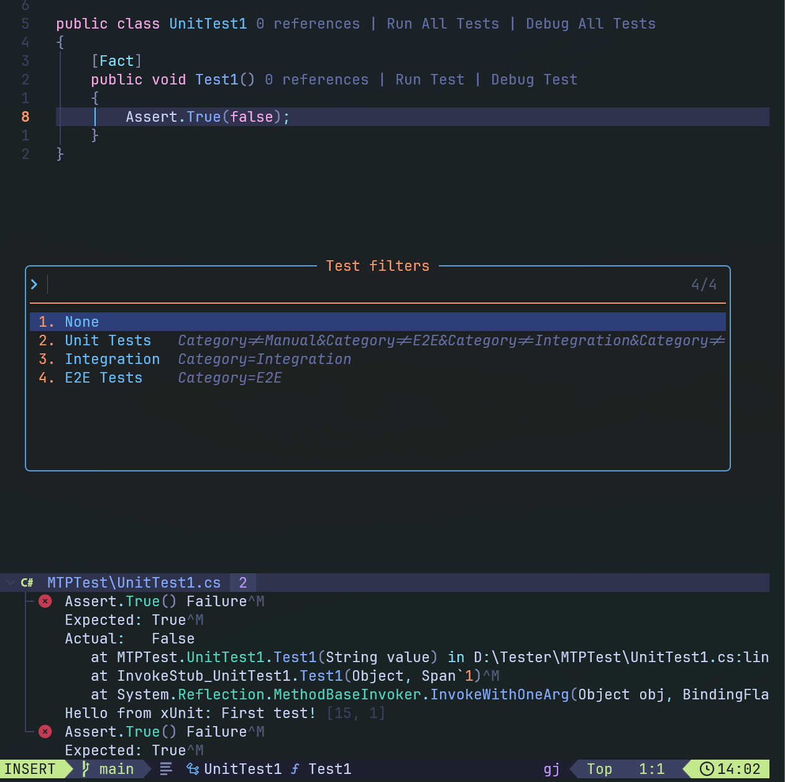

# Dotnet Test Traitor

A simple test runner for .NET projects that lets you run selected tests using predefined filters.

Example for xUnit, where you can define a Trait to categorize your tests:

```csharp
using Xunit;

[Fact]
[Trait("Category", "Integration")]
public void SampleTest()
{
    Assert.True(true);
}
```

To run only tests with this trait, you would typically execute:

- VS Test:
  `dotnet test --filter "Category=Integration"`

- MTP:
  `dotnet test --treenode-filter /*/*/*/*[Category=Integration]`

This plugin simplifies the process by allowing you to predefine reusable filters that can later be selected interactively.
Failed tests are automatically inserted into the Neovim quickfix list and displayed via `trouble.nvim`, making it easy to locate and fix them.

It integrates with:

- `trouble.nvim` for displaying failed tests in the quickfix list



## Installation

### Using lazy.nvim

```lua
{
  "sebastianstudniczek/dotnet-test-traitor.nvim",
  ft = "cs",
  dependencies = {
    "folke/trouble.nvim"
  },
  --- @type dotnet-test-traitor.Configuration
  opts = {
    -- define your own filters
    filters = {
      {
        name = "Unit Tests",
        value = "Category!=Manual&Category!=E2E&Category!=Integration&Category!=Performance&Category!=Service|Type=Service-InMemory",
        is_vstest = true
      },
      { name = "Integration", value = "Category=Integration" },
      { name = "E2E Tests", value = "Category=E2E" },
    },
  },
    keys = {
      { "<leader>tc", "<Plug>(DotnetTestTraitorRun)", mode = "n", desc = "Run Test Category (Dotnet)" },
    },
},
```

You can define your own filters in the configuration under the `opts.filters` field.
Each filter has a `name` (used for display) and a `value` — a filter expression passed to the `dotnet test --filter` command.

> [!IMPORTANT]  
> By default filter assumes using MTP syntax (--treenode-filter)

## Remote usage

It's possible to invoke test execution from outside nvim. For example from git hook

To store neovim address you can use autocmd like this:

```lua
local function write_server_file()
  local server = vim.v.servername

  if server == "" then
    return
  end

  local root = vim.fs.root(0, ".git")
  if not root then
    return
  end

  vim.fn.writefile({ server }, root .. "/.nvim.server")
end

vim.api.nvim_create_autocmd("VimEnter", {
  callback = write_server_file,
})
```

```bash
if [ -f .nvim.server ]; then
 SERVER=$(cat .nvim.server)
 FILTER="/*/*/*/*[Category!=Service]"

 nvim --server "$SERVER" --remote-send "<Cmd>DotnetTestTraitorRun $FILTER<CR>"
fi
```
